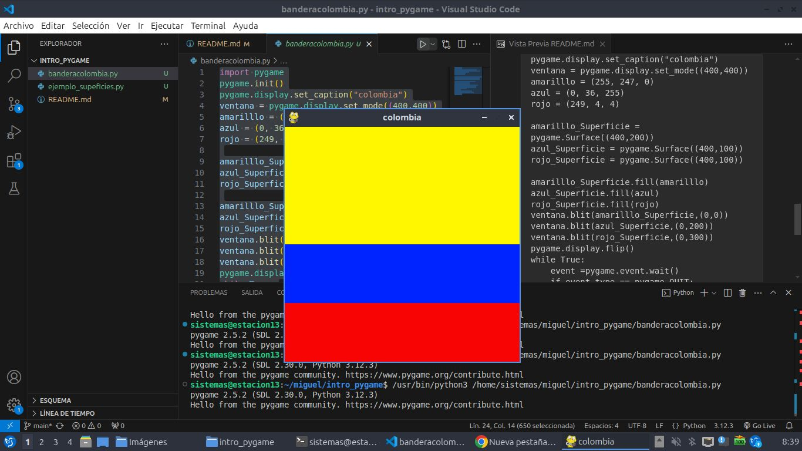

# estructura de un juego en py game

## incializacion

- commo en todo programa en python se deben importar las librerias a utilizar
`import pygame`

- inicilizar pypame usando la funciion inir(). incualiza todos los modulos de pygame
importamos.`pygame.init()`

## visualizacion de la ventana

`ventana =pygame.display.set_mode((600,400))`

- set_mode() es la funcion encargada de definir el tamaño de la ventana.  en el ejemplo, se esta definiendo una ventana de 600px de ancho, por 400px de alto.

```pygame.display.set_caption("Mi ventana")```

- set_caption es la funcion que añade un titulo a la ventana

### funcion set_mode()

`set_mode(size =(0,0),flags =0 ,depth = o,display = 0)`

- size =(600,400):define el tamaño de la ventana.

- flags: define uno o mas  comportamientos para la ventana
    - valores:
        pygame.FULLSCREEN
        pygame.RESIZABLE
    - Ejemplo:
        - flags = pygame.FULLSCREN | pygame.RSIZABLE: pantalla completa.
        dimesiones modificables.
## bucle del juego - game loop
- bucle  infinito que se interrumpirá  al cumplir ciertos criterios.
- relog interno del juego
- en cada interaciion del bucle del juego podemos mver a un personaje. o tenr en cuenta que un objecto a alcanzado a otro o se a cruzaddo la linea de llegada, lo que quiere decir que la partida ha terminado.
- cada ieracion es una opurtiidad para actualizar todos los datos relacionados con el estado actual de la partida
 - en cafa iteracion se realizan las siguientes tareas:
    1. comprobar que no se alcanzan las condiciones de parada. en cuyo  caso se interrumpe el bucle.
    2. actualizar los recursos necesarios para la iteracion actual
    3. obtener las entradas  del sistema, o de interaccion con el juego
    4. actualizar todas las entidades que caracterizan el juego.
    5. refrescar la pantalla.

## superficies pygame
- superficie:  
    - elemento geometrico.
    - linea, poligono, imagen,texto, que se muestra en la patanlla
    - el poligono se puede o no rellenar de color.
    - las superficies se crean de diferente manera dependiendo el tipo:
        - imagen: imagen.load()
        - texto: font.render()
        - superficie generica: pygame.surface()
        - ventana del juego: pygame.display.set_mode()
        - 
        
##  bandera colombia
```import pygame
pygame.init()
pygame.display.set_caption("colombia")
ventana = pygame.display.set_mode((400,400))
amarilllo = (255, 247, 0)
azul = (0, 36, 255)
rojo = (249, 4, 4)

amarilllo_Superficie = pygame.Surface((400,200))
azul_Superficie = pygame.Surface((400,100))
rojo_Superficie = pygame.Surface((400,100))

amarilllo_Superficie.fill(amarilllo)
azul_Superficie.fill(azul)
rojo_Superficie.fill(rojo)
ventana.blit(amarilllo_Superficie,(0,0))
ventana.blit(azul_Superficie,(0,200))
ventana.blit(rojo_Superficie,(0,300))
pygame.display.flip()
while True:
    event =pygame.event.wait()
    if event.type == pygame.QUIT:
        break
pygame.quit() 
```


## gestion de tiempo y los eventos

### modulo "time"

- este modulo frece varias funciones que permite conometrar la sesion actual desde el init() o pausar la ejecusión, por ejemplo.
- funciones:
    - pygme.time.get_ticks
    - pygame.time.waitpygame.time.delay
- objeto clock
    - la fincion "tick" permite actualizar el relog asociado con el juego actual.
    - se llama cada vez que se actualiza la pantalla de juego
    - permite especificar el numero maximo de fotogramasque se muestran por segundo y por tanto  limitar limitar y controlar la velocidad de ejecucion del juego
    - si insertamos en un bucle de juego la siguente linea, garantizamos que nunca ira mas rapido de 5o fotograma por segundo: `Clock.tick(50)`

### gestion de eventos
- hay diferentes formas para que el programa sepa que se ha desencadenado un evento.
-  es esencial quelos programas puedan concer inmediatamente la acciones del jugadora traves del teclado el mause el joystick o cualquier otro periferico  

#### funcion pygame.event.get
- permite obtener todo los eventos en espera de ser procesados y que estan dispoibles en una cola.
- si no hay ninguno se obtiene una coleccion vacia.
```python
# Usamos un bucle for para recorrer todos los eventos de la cleccion obtenida al llamar a la funcion get
for event in pygame.event.get():
    if event.type == pygame.KEYDOWN
        if ennt.key == pygame.K_ESCAPE:
            PARAR_JUEGO = True
```
#### funcion pygame.event.wait
-  esta funcion espera que ocurra un evento, y en cuento sucede esta disponible.
```while True:
    event =pygame.event.wait()
    if event.type == pygame.QUIT:
        break
```
#### funcion pygame.vent.poll
- devuelve solo un de los eventos que estan en la cola de espera

## Sonidos en pygame
- pygme.mixer: módulo que permitela getion del sonido.
- music: submdulo que gestiona la musica de fondo
- Sound: obeto de mixer, que se puede instanciar varias veces para urlo en los efectos del juego.

### archivos de sonido
- Se recomienda usar dos formatos, principalmente
    - formato WAW(waveform audio File format)
    - formato abieroy gratuito OGG
### channe (canal) en pygame
- Un juego tienevarios cnales de sonidos
- Se puede signar un sonio al caanal #1  otro al #2
- Entonceses posibe reproducir sonido simultaniamnete - - - - activado su lectura en diferentes canales

## sprites
- objeto que asocia una ubicacion, una representancion grafica(esta o aqella imagen)y u cojunto de propieddes
- estas propiedades puee ser un nmbre untexto, valores booleanos que caracterizan e objeto en cuestion
-  una posibletraduccion del termino sirte podria ser  "imageen-objeto"que se actualiza con cada iteracion del juego
- cuanto mas complejos esel juego mas objetos grafios tiene que gestionar y actuaizar
- ygame usa no solo la nocion de sprit, sin la nocion de grupo de prites(group)
.la nocion de group permite agrupar los ojets del mismo tipo . ejemlo: todos los sodado de un ejercito, lo que se etiende como una coleccion de instancias de una clasesoldado
-  un determinaadoo prcesomiento e puede aplicar a un conjunto y a u  subconjunto d sprite. ejemplo:cambiar el color de todo los enemigos o hacer invisibles algunos objetos